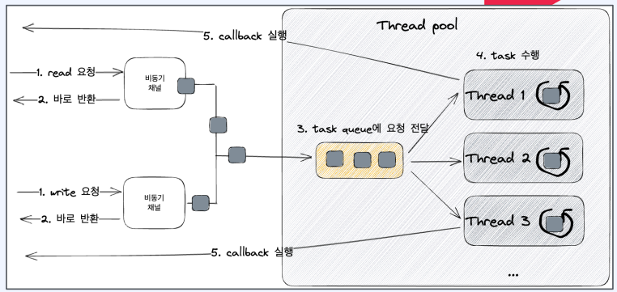

## Java AIO
- AsynchronousChannel을 지원
  - AsynchronousSocketChannel
  - AsynchronousServerSocketChannel
  - AsynchronousFileChannel
- callback과 future 지원
- Thread pool과 epoll, kqueue 등의 이벤트 알림 system call을 이용
- I/O가 준비되었을때, Future 혹은 callback으로 비동기적인 로직 처리 가능


### AsynchronousFileChannel 
| 항목               | Callback 방식 (CompletionHandler)                                                                                 | Future 방식 (Future + Polling)                                                              |
|--------------------|-------------------------------------------------------------------------------------------------------------------|---------------------------------------------------------------------------------------------|
| **결과 처리 방식**   | 비동기 읽기 작업이 완료되면 자동으로 `completed()` 콜백이 호출되어 결과를 처리                                | `channel.read()`가 반환하는 Future를 폴링하여 작업 완료 여부를 확인한 후 결과를 처리             |
| **제어 흐름**        | 이벤트 기반으로 동작하여, 콜백 내에서 결과 처리. 단, 메인 스레드에서는 `while(channel.isOpen())`로 상태를 체크함     | 순차적 코드 흐름을 사용하며, 폴링 루프(`while(!channelRead.isDone())`)로 작업 완료를 기다림          |
| **코드 가독성**      | 콜백 내부에 결과 처리 로직이 포함되어 있어 여러 콜백이 중첩되면 가독성이 떨어질 수 있음 (콜백 지옥)                   | 순차적인 흐름으로 작성되어 이해하기 쉽지만, 폴링 로직이 추가되어 있음                              |
| **CPU 사용 및 효율** | 이벤트 기반이므로 작업 완료 시 즉시 콜백으로 처리되지만, 메인 스레드에서 채널 상태를 지속적으로 체크하는 루프가 있음      | 폴링 방식으로 작업 완료 전까지 불필요한 CPU 사이클을 소모할 수 있음                                |
| **응답 속도**        | 읽기 작업 완료 시 콜백이 즉시 실행되어 빠른 응답이 가능                                                            | 폴링 주기에 따라 작업 완료 확인에 약간의 지연이 발생할 수 있음                                    |
| **자원 관리**        | 작업 완료 후 콜백 내에서 `channel.close()`를 직접 호출해야 함                                                     | try-with-resources를 사용하여 채널 자원을 자동으로 관리할 수 있음                                 |
| **에러 처리**        | `failed()` 콜백을 통해 비동기 작업에서 발생한 예외를 별도로 처리할 수 있음                                           | Future.get() 또는 폴링 후 예외 발생 시 별도의 예외 처리 로직을 구현해야 함                          |


#### AsynchronousFileChannel - callback
```java
var file = new File(AsyncFileChannelReadCallbackExample.class
    .getClassLoader()
    .getResource("hello.txt")
    .getFile());
// AsynchronousFileChannel을 열어서 파일 경로를 설정
var channel = AsynchronousFileChannel.open(file.toPath());
ByteBuffer buffer = ByteBuffer.allocateDirect(1024);

// 비동기 읽기 요청, CompletionHandler를 사용하여 결과 처리
channel.read(buffer, 0, null, new CompletionHandler<Integer, Object>() {
    @SneakyThrows
    @Override
    public void completed(Integer result, Object attachment) {
        // 읽기가 완료되면 버퍼를 읽기 모드로 전환
        buffer.flip();
        // 버퍼의 내용을 UTF-8 문자열로 디코딩
        var resultString = StandardCharsets.UTF_8.decode(buffer);
        log.info("result: {}", resultString);
        // 파일 채널 닫기
        channel.close();
    }
    
    @Override
    public void failed(Throwable ex, Object attachment) {
        // 실패 시 예외 처리 (여기서는 아무 작업도 수행하지 않음)
    }
});

// 채널이 열려있는 동안 주 스레드가 계속 로그를 남김
while (channel.isOpen()) {
    log.info("Reading .");
}
```

#### AsynchronousFileChannel - future
```java
var file = new File(AsyncFileChannelReadFutureExample.class
    .getClassLoader()
    .getResource("hello.txt")
    .getFile());
// try-with-resources를 사용하여 채널을 열고 작업 완료 후 자동 종료
try(var channel = AsynchronousFileChannel.open(file.toPath())) {
    var buffer = ByteBuffer.allocateDirect(1024);
    // 비동기 읽기 요청, Future 객체를 반환받음
    Future<Integer> channelRead = channel.read(buffer, 0);
    
    // Future가 완료될 때까지 폴링
    while (!channelRead.isDone()) {
        log.info("Reading .");
    }
    
    // 작업 완료 후 버퍼를 읽기 모드로 전환
    buffer.flip();
    // 버퍼의 내용을 UTF-8 문자열로 디코딩하여 결과 출력
    var result = StandardCharsets.UTF_8.decode(buffer);
    log.info("result: {}", result);
}
```

### AsynchronousServerSocketChannel
| 항목               | 콜백 방식 (CompletionHandler 방식)                                                   | Future 방식 (Future + Polling 방식)                                              |
|--------------------|--------------------------------------------------------------------------------------|----------------------------------------------------------------------------------|
| 결과 처리 방식      | 작업 완료 시 자동으로 콜백 메서드가 호출되어 결과를 처리                                  | Future 객체의 isDone()/get()를 통해 작업 완료 여부를 확인한 후 결과 처리             |
| 제어 흐름          | 이벤트 기반으로 비동기 작업을 처리하여, 별도의 폴링 없이 즉각적으로 반응                     | 폴링 루프를 통해 작업 완료를 기다리므로 순차적인 코드 흐름으로 진행                   |
| 코드 가독성        | 여러 콜백이 중첩되면 가독성이 떨어질 수 있음 (콜백 지옥 현상)                               | 순차적인 흐름으로 작성되어 비교적 이해하기 쉬움                                     |
| CPU 사용 및 효율   | 이벤트 기반이므로 폴링이 없어 CPU 자원 사용이 효율적임                                     | 폴링 방식 때문에 작업 완료 전까지 불필요한 CPU 사용이 발생할 수 있음                   |
| 응답 속도          | 작업이 완료되는 즉시 콜백이 실행되어 빠른 응답이 가능                                       | 폴링 주기에 따라 약간의 지연이 발생할 수 있음                                      |
| 자원 관리          | 작업 완료 시 콜백 내부에서 직접 자원(예: 소켓) 해제를 구현해야 함                           | try-with-resources 등 구조를 사용할 수 있어 자원 관리가 상대적으로 간편함               |
| 에러 처리          | 콜백의 failed() 메서드를 통해 비동기 작업의 에러를 별도로 처리 가능                         | Future.get() 호출 시 발생하는 예외를 직접 처리해야 하므로 에러 처리 로직이 필요함         |

#### callback
```java
// AsynchronousServerSocketChannel을 이용해 비동기적으로 클라이언트 연결을 수락하고, 콜백을 통해 요청/응답을 처리하는 예제
serverSocketChannel.accept(null, new CompletionHandler<AsynchronousSocketChannel, Object>() {
    // 클라이언트 연결이 성공하면 호출되는 콜백
    @Override
    public void completed(AsynchronousSocketChannel clientSocket, Object attachment) {
        // 1024바이트 크기의 direct 버퍼 생성
        var requestBuffer = ByteBuffer.allocateDirect(1024);
        
        // 클라이언트로부터 데이터를 읽기 위한 비동기 작업 실행, 또 다른 CompletionHandler 사용
        clientSocket.read(requestBuffer, null, new CompletionHandler<Integer, Object>() {
            // 읽기 작업이 완료되면 호출됨
            @SneakyThrows
            @Override
            public void completed(Integer bytesRead, Object attachment) {
                // 버퍼를 읽기 모드로 전환
                requestBuffer.flip();
                // UTF-8로 디코딩하여 요청 문자열 생성
                var request = StandardCharsets.UTF_8.decode(requestBuffer);
                log.info("request: {}", request);
                
                // 응답 메시지 작성
                var response = "This is server.";
                var responseBuffer = ByteBuffer.wrap(response.getBytes());
                // 응답을 클라이언트에 전송
                clientSocket.write(responseBuffer);
                // 클라이언트 소켓 종료
                clientSocket.close();
                log.info("end client");
            }
            
            // 읽기 작업 실패 시 호출됨
            @Override
            public void failed(Throwable ex, Object attachment) {
                // 실패 처리 (여기서는 특별한 처리 없음)
            }
        });
    }
    
    // 클라이언트 연결 수락 실패 시 호출됨
    @Override
    public void failed(Throwable ex, Object attachment) {
        // 실패 처리 (여기서는 특별한 처리 없음)
    }
});

```

#### future
```java
// AsynchronousServerSocketChannel을 이용해 비동기적으로 클라이언트 연결을 수락하고,
// Future를 통해 완료 여부를 폴링하여 요청/응답을 처리하는 예제
var serverSocketChannel = AsynchronousServerSocketChannel.open();
var address = new InetSocketAddress("localhost", 8080);
serverSocketChannel.bind(address);

// 클라이언트 연결 수락 요청을 보내고 Future 객체를 반환받음
Future<AsynchronousSocketChannel> clientSocketFuture = serverSocketChannel.accept();

// 클라이언트 연결이 완료될 때까지 폴링
while (!clientSocketFuture.isDone()) {
    Thread.sleep(100);
    log.info("Waiting .");
}

// 완료된 Future에서 클라이언트 소켓 객체를 가져옴
var clientSocket = clientSocketFuture.get();

// 1024바이트 크기의 direct 버퍼 생성
var requestBuffer = ByteBuffer.allocateDirect(1024);

// 클라이언트로부터 데이터를 읽기 위한 비동기 작업 요청, Future 객체 반환
Future<Integer> channelRead = clientSocket.read(requestBuffer);

// 읽기 작업이 완료될 때까지 폴링
while (!channelRead.isDone()) {
    log.info("Reading .");
}

// 버퍼를 읽기 모드로 전환하고 UTF-8 문자열로 디코딩하여 요청 처리
requestBuffer.flip();
var request = StandardCharsets.UTF_8.decode(requestBuffer);
log.info("request: {}", request);

// 응답 메시지 작성 및 전송
var response = "This is server.";
var responseBuffer = ByteBuffer.wrap(response.getBytes());
clientSocket.write(responseBuffer);

// 클라이언트 소켓 종료
clientSocket.close();

```