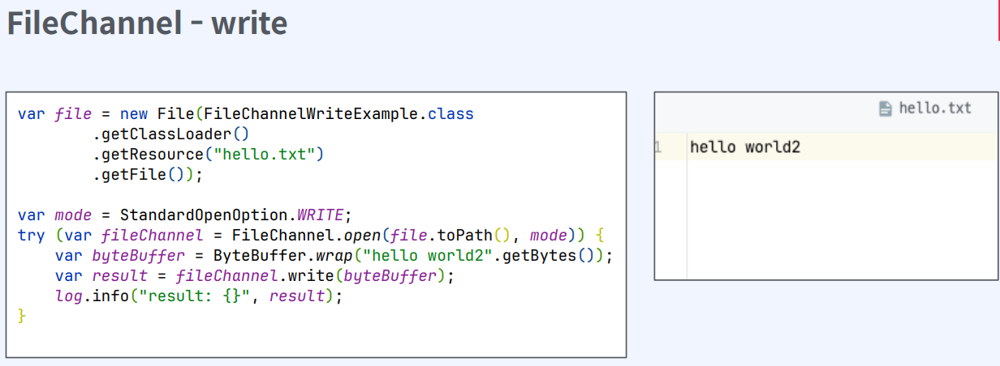

## Java NIO
- 함수 호출 모델

  | 구분            | Sync                                     | Async    |
  |-----------------|------------------------------------------|----------|
  | **Blocking**    | Java IO                                  | X        |
  | **Non-blocking**| Java NIO  (File IO는 non-blocking 불가능) | Java AIO |

- I/O 모델

  |               | Sync                   | Async |
  |---------------|------------------------|--------|
  | **Blocking**  | Java IO               | X      |
  | **Non-blocking** | Java NIO, Java AIO    | X      |

- Java IO
  - 파일과 네트워크에 데이터를 읽고 쓸 수 있는 API 제공
  - byte 단위로 읽고 쓸 수 있는 stream (InputStream과 OutputStream)
  - blocking으로 동작
  - 한계
    - 동기 blocking 으로 동작
      - application이 read를 호출하면, kernel이 응답을 돌려줄때까지, 아무것도 할 수 없다
      - I/O 요청이 발생할 때마다 쓰레드를 새로 할당하면, 쓰레드를 생성 및 관리하는 비용과 컨텍스트 스위칭으로 인한 cpu 자원 소모
    - 커널 버퍼에 직접 접근 불가. 따라서 메모리 copy가 발생
    
      - hardware에서 값을 읽어오면, disk controller가 DMA를 통해서 커널 버퍼에 값을 복사
      - 커널 버퍼에서 jvm 버퍼로 복사
      - 이 과정에서 cpu 자원을 소모
      - jvm 버퍼, jvm 메모리에 있기 때문에 gc 대상이 되고 이는 또한 cpu 자원을 소모
  
### InputStream
- Closable 구현. 명시적으로 close하거나 trywith-resources 사용 가능
- read: stream으로 데이터를 읽고, 읽은 값을 반환. -1이라면 끝에 도달했다는 것을 의미
- close: stream을 닫고 더 이상 데이터를 읽지않는다
- 어떤 source로부터 데이터를 읽을지에 따라 다양한 구현체 존재
  - FileInputStream, ByteArrayInputStream, BufferedInputStream
  

- ByteArrayInputStream
  - byte array로부터 값을 읽을 수 있다
  - 메모리가 source가 된다
- FileInputStream
  - file로부터 byte 단위로 값을 읽을 수 있다
  - File 객체나 path를 통해서 FileInputStream을 열 수 있다
  - application에서 blocking 이 일어난다
- BufferedInputStream
  - 다른 inputStream과 조합해서 사용
  - 임시 저장 공간인 buffer를 사용
  - 한 번 read를 호출할 때 buffer 사이즈만큼 미리 조회
  - 그 이후 read를 호출할 때 미리 저장한 buffer 데이터 반환
  
- ServerSocket
  - accept
    - serverSocket을 open하여 외부의 요청을 수신
    - bind, accept를 통해서 serverSocket open을 준비
  - read
    - accept가 끝나면 반환값으로 client의 socket을 전달
    - client socket의 getInputStream으로 socket의 inputStream에 접근

- SocketInputStream
  - SocketInputStream은 public이 아니기 때문에 직접 접근이 불가능
  - socket.getInputStream으로만 접근 가능
  - blocking이 발생한다

### OutputStream
- write시 바로 전송하지 않고 버퍼에 저장한 다음 일정량의 데이터가 모이면 한번에 전달
- Closable 구현. 명시적으로 close하거나 trywith-resources 사용 가능
- write: stream으로 데이터를 쓴다
- flush: 버퍼의 모든 데이터를 출력하고 비운다(Flushable implement하는 이유)
- close: stream을 닫고 더 이상 쓰지 않는다
   

- ByteArrayOutputStream
  - byte array에 값을 쓸 수 있다
  - 메모리가 destination이 된다
- FileOutputStream
  - file에 값을 쓸 수 있다
  - File 객체나 path를 통해서 FileOutputStream을 열 수 있다
  - application에서 blocking 이 일어난다
- BufferedOutputStream
  - 다른 outputStream과 조합해서 사용
  - Buffer를 사용
  - 한 번 write를 호출하면 buffer에만 write
  - 추후에 flush하여 한번에 outputStream에 write
- SocketOutputStream
  - SocketOutputStream은 public이 아니기 때문에 직접 접근이 불가능
  - socket.getOutputStream으로만 접근 가능
  - blocking이 발생한다

### Java NIO
- java New Input/Output
- buffer 기반
- non-blocking 지원
- selector, channel 도입으로 높은 성능 보장

    

- Channel과 Buffer
  - 데이터를 읽을 때: 적절한 크기의 Buffer를 생성하고 Channel의 read() 메서드를 사용하여 데이터를 Buffer에 저장.
  - 데이터를 쓸 때: 먼저 Buffer에 데이터를 저장하고 Channel의 write() 메서드를 사용하여 목적지로 전달
  - clear() 메서드로 초기화하여 다시 사용 가능

- Buffer 위치 속성
  - capacity: Buffer가 저장할 수 있는 데이터의 최대 크기. Buffer 생성시 결정되며 변경 불가
  - position: Buffer에서 현재 위치를 카리킨다. 버퍼에서 데이터를 읽거나 쓸 때, 해당 위치부터 시작. Buffer에 1Byte가 추가될 때마다 1 증가
  - limit: Buffer에서 데이터를 읽거나 쓸 수 있는 마지막 위치. limit 이후로 데이터를 읽거나 쓰기 불가. 최초 생성시 capacity와 동일
  - mark: 현재 position 위치를 mark()로 지정할 수 있고 reset() 호출시 position을 mark로 이동
  - 0 <= mark <= position <= limit <= capacity
- Buffer 위치 초기 상태
  - capacity는 초기 주어진 값으로 세팅
  - limit은 capacity와 동일
  - position은 0
- Buffer 위치 메서드 
  - flip
    - Buffer의 limit 위치를 현재 position 위치로 이동시키고, position을 0으로 리셋
    - Buffer를 쓰기 모드에서 읽기 모드로 전환하는 경우 사용

  - rewind 
    - Buffer의 position 위치를 0으 로 리셋. limit은 유지
    - 데이터를 처음부터 다시 읽는 경우 사용

  - clear
    - Buffer의 limit 위치를 capacity 위치로 이동시키고, position을 0으로 리셋
    - Buffer를 초기화할 때 사용

### Java NIO에서 커널 버퍼에 직접 접근
- DirectByteBuffer
  - native 메모리(off-heap)에 저장
  - 커널 메모리에서 복사를 하지 않으므로 데이터를 읽고 쓰는 속도가 빠르다
  - 비용이 많이 드는 system call을 사용하므로 allocate, deallocate가 느리다
- HeapByteBuffer
  - JVM heap 메모리에 저장. byte array를 랩핑
  - 커널 메모리에서 복사가 일어나므로 데이터를 읽고 쓰는 속도가 느리다
  - gc에서 관리가 되므로 allocate, deallocate가 빠르다

- 동기 소켓

- 비동기 소켓
  - SelectableChannel 활용
  
    - configureBlocking 과 register 함수 제공
    - configureBlocking(Non-Blocking)
      - serverSocketChannel의 accept
      - socketChannel의 connect 
  
  
  - FileChannel은 NonBlocking 불가
